# תוכנית refactor עיצובי לרכיבי המערכת

**סטטוס:** טיוטה לאישור, לפני יישום · **ענף:** `claude/design-refactor-plan` · **תאריך:** 15.09.2026

המסמך מסכם מיפוי של טופס העלאת המיועדים ושל שכבת הרכיבים בכל המערכת, ומציע
תוכנית עבודה בשלבים. כל המדידות והצילומים הופקו מהסביבה המקומית (נתונים
פיקטיביים) ב-Playwright, ברוחבים 390, 768, 1024, 1280 ו-1440 פיקסלים.

---

## 1. מטרה

- טופס המיועדים נוח למילוי בכל גודל מסך: שדות ברוחב שמתאים לתוכן, היררכיה
  ברורה, ושגיאות שנראות מיד.
- שפה עיצובית אחידה בכל המערכת: אותם גבהים, אותם רכיבים לטבלאות, כרטיסים,
  כותרות עמוד, סטטוסים ומצבים ריקים.
- כללים שנאכפים אוטומטית, כדי שהמערכת לא תחזור לנקודת ההתחלה.

---

## 2. ממצאים: טופס העלאת המיועדים

### הבעיה העיקרית היא פריסה, לא גודל השדות

השדות עצמם בגובה 36-37px וטקסט 16px. מה שיוצר את התחושה של "קטן וצפוף":
רשת של 12 עמודות בתוך אזור טופס שרוחבו 892px בלבד גם במסך 1440, בגלל סרגל
צד קבוע של 220px וריפוד כפול. כל שדה מוגדר במספר עמודות קבוע, ואין שלב ביניים
בין מובייל לדסקטופ.

| רוחב מסך | רוחב אזור הטופס | שדה ב-3 עמודות | תיבת השם בשדה שם עם תוארים |
|---|---|---|---|
| 1440 | 892px | 211px | **85px** |
| 1280 | 808px | 190px | **57px** |
| 1024 | 552px | 126px | **24px** |
| 768 | 296px | **62px** | **24px** |
| 390 (מובייל) | 294px | עמודה אחת | 92px |

**היקף הטופס:** 7 שלבים, 20 מקטעים, 123 שדות (84 רגילים ו-39 בתוך 12 רשומות
חוזרות). 53 שדות מוגדרים ב-3 עמודות, 22 ב-4, אחד ב-2.

### צילומי מסך

**פרטים אישיים, דסקטופ 1440:** רוב השדות ב-211px, שורות שנשברות לא אחיד
("מתעתד" לבד בשורה), ושדה החיפוש במאגר נראה כמו כפתור ראשי.

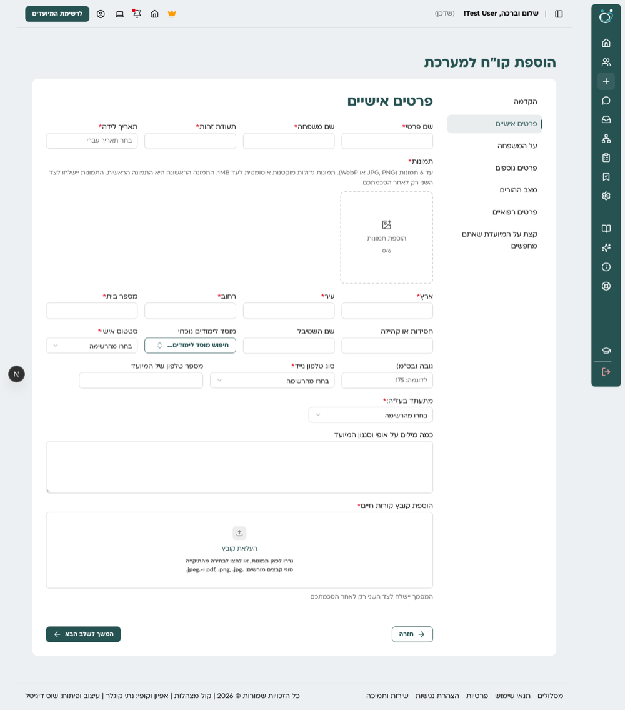

**על המשפחה, דסקטופ 1440:** בשדות השם עם תוארים לא נשאר מקום לשם עצמו, רק
לשני שדות התואר. "שם נעורים של האם" מוגדר בשתי עמודות, והתווית נשברת לשתי
שורות.

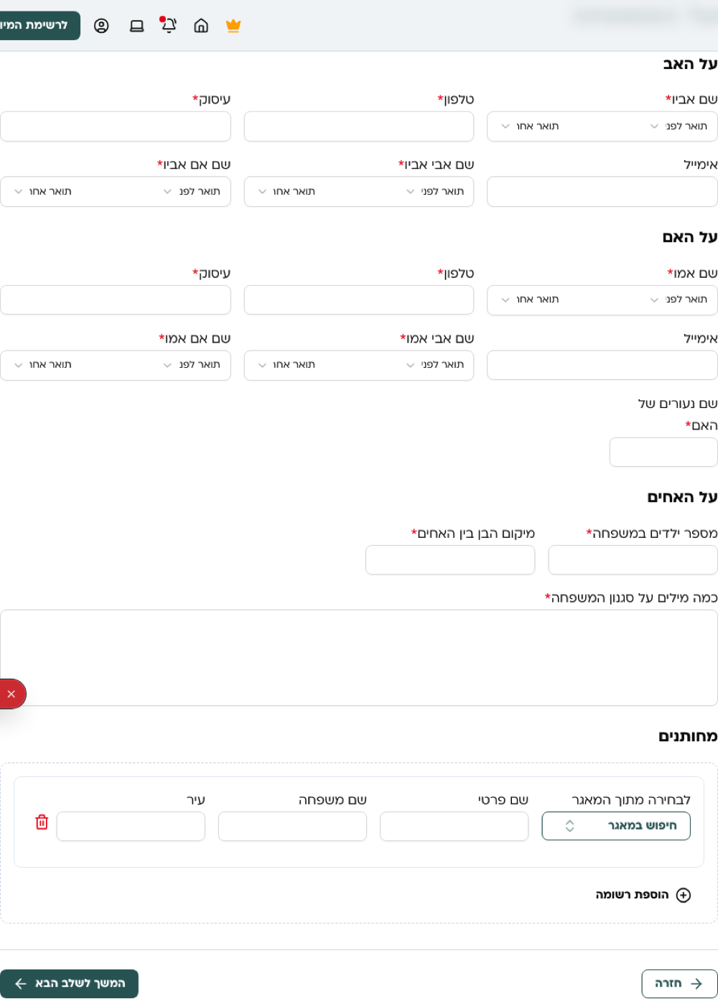

**על המשפחה, טאבלט 1024:** אותה בעיה מחריפה: תיבת השם בת 24px.

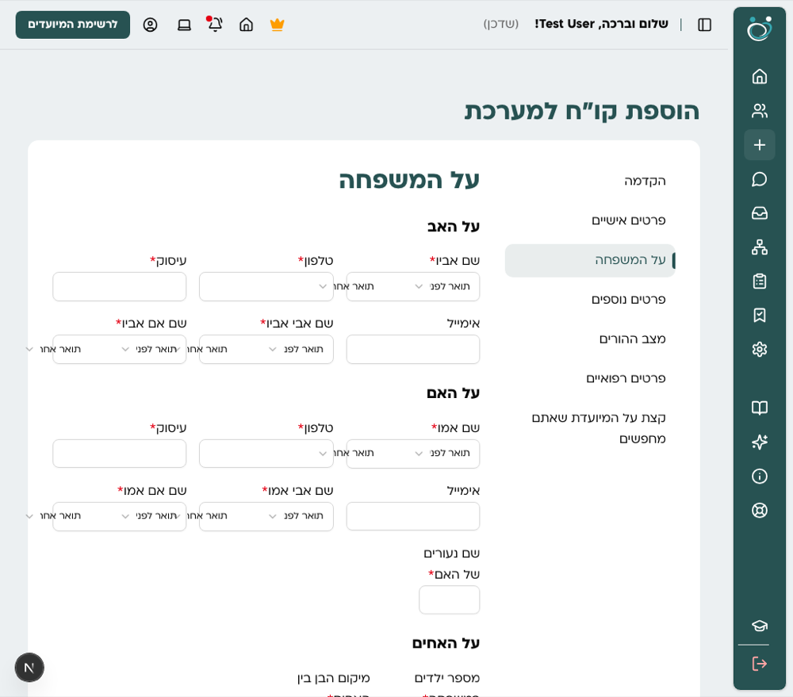

**לחיצה על "המשך לשלב הבא" עם שדות חסרים, דסקטופ:** רואים רק את השגיאות של
השדות התחתונים. השגיאה הראשונה נמצאת 385px מעל המסך, הדף לא גולל אליה והפוקוס
נשאר על הכפתור, כך שבשלבים ארוכים נראה כאילו הכפתור לא עובד.

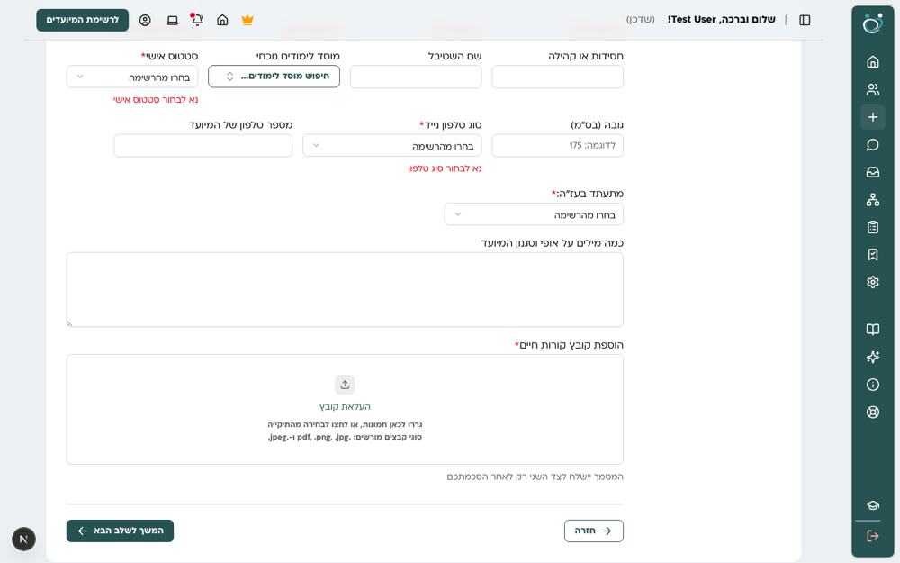

**פרטים נוספים עם רשומות חוזרות, דסקטופ:** 7 רשומות חוזרות מקוננות (כרטיס בתוך
מסגרת מקווקוות), כפתור "הוספת רשומה" כללי, והשלב גבוה 2739px.

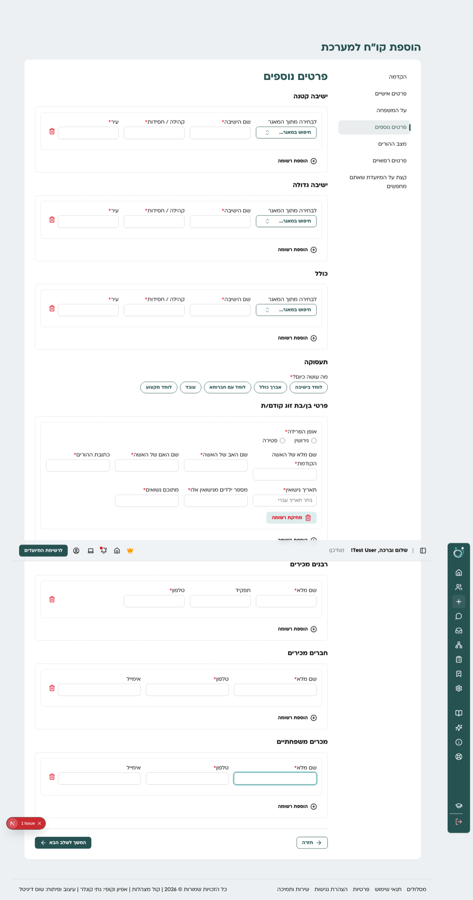

**ניווט בין השלבים, מובייל 390:** רואים 3 מתוך 7 שלבים, הלשונית בקצה חתוכה
("על המשפר"), ואין סימן שאפשר לגלול.

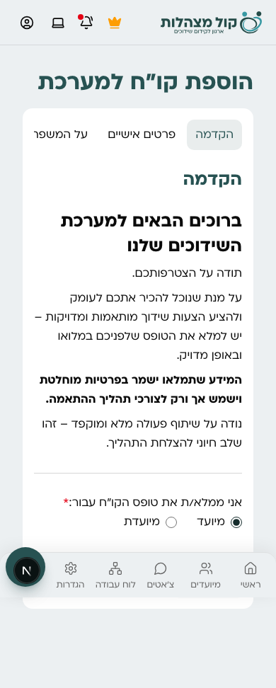

**על המשפחה, מובייל 390:** הטופס תופס 294 מתוך 390px בגלל ריפוד כפול, וכל שדה
ברוחב מלא, גם מספר בית וגובה.

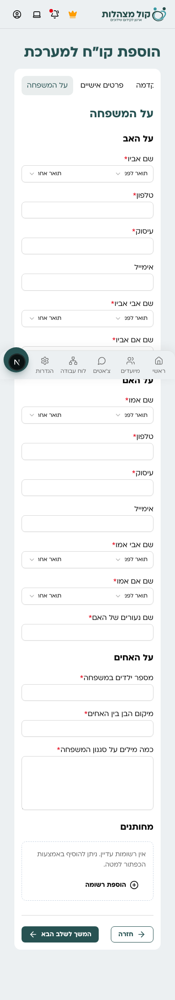

**לחיצה על "הבא" עם שדות חסרים, מובייל:** רואים רק את השגיאות הקרובות לכפתור;
השגיאה הראשונה נמצאת 1303px מעל המסך, והדף לא גולל אליה.
הניווט התחתון הקבוע (64px) מסתיר תוכן, וכפתורי הפעולה אינם דביקים.

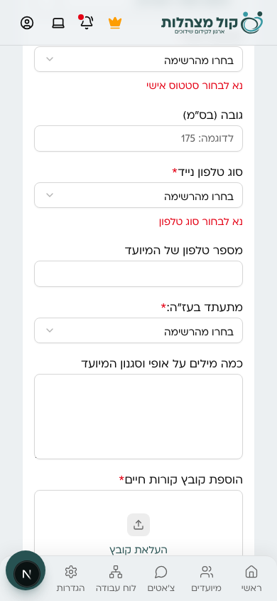

**פרטים נוספים עם רשומות חוזרות, מובייל:** השלב גבוה 4603px.

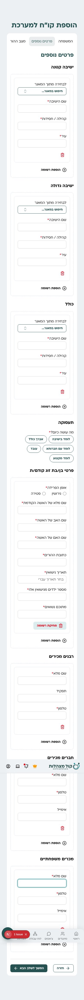

### הבעיות לפי השפעה על המשתמש

| # | בעיה | היכן בקוד |
|---|---|---|
| 1 | שדות השם עם תוארים לא שמישים ברוב הרוחבים | `create-form/fields/dynamic-field.tsx:184-247`, `fileds-data.ts:497-666` |
| 2 | אזור טופס צר מדי לרשת של 12 עמודות, בלי שלב ביניים לטאבלט | `student-form-wizard.tsx:350-351`, `dynamic-field.tsx:1030` |
| 3 | "הבא" עם שגיאה לא גולל ולא מעביר פוקוס לשגיאה | `student-form-wizard.tsx:298-311` |
| 4 | התווית של `FormLabel` לא עוקבת אחרי מערכת העיצוב: 18px רגיל במקום 16px מודגש, כוכבית צמודה | `components/ui/form.tsx:80-82` |
| 5 | תוויות שנשברות לכמה שורות ושוברות את יישור השורה | `fileds-data.ts:671` ורשומת נישואים קודמים |
| 6 | רשומות חוזרות מקוננות, כפתור הוספה כללי | `dynamic-field.tsx:827-937` |
| 7 | כוכבית "חובה" בשדות של רשומות חוזרות, אבל הוולידציה לא בודקת אותם | `student-form-wizard.tsx:291`, `schema.ts` |
| 8 | ניווט שלבים בלי מספור, התקדמות או סימון שלב שהושלם | `student-form-wizard.tsx:518-540` |
| 9 | מובייל: ריפוד כפול, שדות קצרים ברוחב מלא, כפתורים לא דביקים | `student-form-wizard.tsx` |
| 10 | גבהים לא אחידים (שדה 37px, רשימה נפתחת 36px), שדה חיפוש שנראה ככפתור | `components/ui/input.tsx`, `native-select.tsx`, `combobox.tsx` |
| 11 | כותרת עמוד וכותרת שלב באותו גודל (36px), מרווח בין מקטעים כמעט כמו בין שדות | `student-form-wizard.tsx:347,365,452` |
| 12 | טקסט עזרה במקומות שונים, אזור העלאת קו״ח עם טקסט 14px | `dynamic-field.tsx:353,708,781` |

### בעיות מבנה בקוד הטופס

- `dynamic-field.tsx` בן 1268 שורות: שרשרת תנאים אחת לכל סוגי השדות, עם בלוק
  תווית, כוכבית ושגיאה שחוזר כ-9 פעמים.
- `fileds-data.ts` בן 1964 שורות: רשימות התוארים מועתקות ל-6 שדות, ו-`institutionId`
  מוגדר פעמיים.
- `shouldDisplayField` ו-`getValueByPath` מועתקות גם ל-wizard.
- `form.watch()` ב-wizard מרנדר מחדש את כל השדות בכל הקשה.
- קוד מת: `fields/select.tsx` לא מיובא, `fields/text.tsx` מתעלם מה-props בענפי
  textarea ו-switch, ו-`vertical: true` לא עושה כלום.

---

## 3. ממצאים: המערכת כולה

| תחום | מה נמצא |
|---|---|
| טבלאות | 6 טבלאות רשת ידניות (`grid-cols-[...]` + subgrid) ו-5 טבלאות HTML עם אותן מחלקות. אין `ui/table`. הרשימה (`students/components/list.tsx`), המועדפים (`dashboard/.../favorites.tsx`) והילדים (`dashboard/.../children.tsx`) כמעט זהים, כולל `parseStatus` בשלוש גרסאות |
| צבעים | אין צבעי סטטוס (success, warning, info) בערכת העיצוב. 161 שימושים בצבעים ישירים של Tailwind ב-20+ קבצים, כולל תגי הסטטוס של השידוכים ו-7 תגים ידניים בעמודי הניהול |
| גבהים | שדה טקסט בלי גובה (37px), רשימה נפתחת `h-9`/`h-8`, כפתור `h-9`/`h-7`/`h-12`. כפתור קטן 28px לעומת רשימה נפתחת קטנה 32px |
| טפסים | שלוש שיטות: `react-hook-form` עם `Form`, `useState` ידני (כל טפסי ההתחברות, יצירת משתמש, עריכת מאמר), ו-`Field` שמשמש פעם אחת. `zod` רק בטופס המיועדים |
| כותרות עמוד | 36px מופיע כ-h1 ידני (11 פעמים), כ-h2 של `DashboardSection` (כל עמודי הניהול ולוח הבקרה), ועם `!` שעוקף סגנונות. 16 עמודים בלי h1 |
| רכיבי מבנה | `Box` מעביר רק `className` ומפיל id, onClick ו-aria. 42 קבצים עם כרטיסים שנבנו ביד. `shadchan-card` ו-`staff-card` בהגדרות כמעט זהים |
| מצבי ריק וטעינה | 7 הודעות "אין תוצאות" ידניות לצד `ui/empty`. אין אף `loading.tsx`, ושלדי טעינה מקומיים בכל עמוד |
| דיאלוגים | 8 רוחבים שונים, `dir="rtl"` חוזר על 10 דיאלוגים |
| RTL | מחלקות כיוון פיזיות (`ml`, `left`, `text-right`...) בכ-50 מקומות מחוץ ל-`components/ui`, ואייקוני חיצים שלא מתהפכים |
| נגישות | כ-25 שדות בלי תווית מקושרת, 7 `Label` בלי `htmlFor`, 10 כפתורי אייקון בלי `aria-label` |
| אכיפה | ESLint אוכף רק טיפוגרפיה. `docs/DESIGN.md` לא תואם לקוד בכמה מקומות (משקל כותרת כרטיס, מיקום `.box`, 3 מחלקות רשת שלא בשימוש) |
| קבצים גדולים | `app/app/students/[id]/page.tsx` (1956 שורות), `dynamic-field.tsx` (1268), `settings/staff/page.tsx` (660), `students/components/list.tsx` (604) |

---

## 4. עקרונות

1. **תשתית לפני עמודים.** קודם סולם גבהים, צבעי סטטוס ורכיב שדה אחד, ורק אחר כך
   מחליפים עמודים. אחרת כל עמוד ימציא פתרון משלו שוב.
2. **רוחב שדה סמנטי, לא מספר עמודות.** הנתונים אומרים "קצר", "בינוני", "ארוך"
   או "מלא", ומקום אחד מתרגם את זה לכל גודל מסך.
3. **שינוי מבנה בלי שינוי התנהגות.** פיצול קבצים ורכיבים נעשה בנפרד משינויי
   עיצוב, ומכוסה בבדיקות ה-e2e הקיימות.
4. **אב-טיפוס לפני פריסה רחבה.** בכל שלב מתחילים בדוגמה אחת, מאשרים כיוון, ורק
   אז ממשיכים.
5. **נעילה בכללים.** כל החלטה שנקבעת בשלב 0 נאכפת ב-ESLint בשלב 5.

---

## 5. שלבי העבודה

### שלב 0: תשתית

| משימה | תוצר |
|---|---|
| סולם גבהים לרכיבים | גובה אחיד לשדה טקסט, רשימה נפתחת, שדה חיפוש וכפתור, בגדלים sm, default, lg. ברירת מחדל מוצעת: 40px בדסקטופ, 44px במובייל |
| צבעי סטטוס | טוקנים success, warning, info (כולל גווני רקע וטקסט), ו-`Badge` עם תכונת גוון |
| רכיב `FormField` אחד | תווית 16px מודגשת, כוכבית עם רווח, טקסט עזרה תמיד מתחת לשדה, שגיאה במקום קבוע |
| רכיב `InputGroup` | שדה עם תוספת לפני ואחרי, עבור שדות השם עם תוארים |
| ניקוי רכיבים | `Box` מעביר את כל ה-props; מחיקת `fields/select.tsx`; תיקון או הסרה של `fields/text.tsx` |
| דף הדוגמאות | הוספת הרכיבים החדשים ל-`/dev/design-system` |

**קבלה:** כל הרכיבים החדשים מופיעים בדף הדוגמאות בשלושה רוחבים, ובדיקות ה-e2e עוברות.

### שלב 1: טופס המיועדים

| משימה | תוצר |
|---|---|
| מעטפת | סרגל צד צר עם מספור מעל 1024px; פס שלבים ממוספר עליון מתחת ל-1024px; ריפוד כפול מוסר; כפתורי "חזרה" ו"המשך" דביקים, מעל הניווט התחתון במובייל |
| רוחב שדות | `width: "sm" \| "md" \| "lg" \| "full"` במקום `columns`. מיפוי אחד: עמודה אחת במובייל, 2 בטאבלט, 3-4 בדסקטופ רחב. סידור מחדש של שורות שנשברות |
| שדה שם עם תוארים | השם ברוחב מלא, התוארים כתוספות קומפקטיות בתוך השדה, או מתחת לשם במסך צר (ראו החלטה 4) |
| ניווט ושגיאות | מספור, סימון שלב שהושלם, "שלב X מתוך 7" במובייל, גלילה ופוקוס לשגיאה הראשונה |
| רשומות חוזרות | כרטיס שטוח לכל רשומה, כפתורי הוספה ספציפיים ("הוספת אח/אחות", "הוספת ממליץ"), מצב ריק ברור, והתאמת הכוכביות לוולידציה בפועל |
| היררכיה | כותרת שלב קטנה מכותרת העמוד, מפרידים בין מקטעים, מרווח ברור בין מקטעים לשדות |
| פיצול קוד | רכיב נפרד לכל סוג שדה סביב `FormField`; `fileds-data.ts` לקובץ לכל שלב, עם רשימות התוארים והנוסחים לפי מגדר במקום אחד; `useWatch` ממוקד במקום `form.watch()` |

**סדר ביצוע:** אב-טיפוס על השלב "על המשפחה" (הבעיות הקשות ביותר), אישור כיוון,
ורק אז שאר השלבים.

**קבלה:**
- תיבת השם לפחות 200px בכל רוחב מ-768 ומעלה, ולפחות 80% מרוחב המסך במובייל.
- אין שדה טקסט צר מ-160px בדסקטופ.
- "הבא" עם שגיאה מגלגל לשגיאה הראשונה ומעביר אליה פוקוס (בדיקת e2e חדשה).
- יצירה ועריכה של כרטיס מלא עוברות (בדיקות e2e קיימות וחדשה לטופס מלא).

### שלב 2: רכיבים משותפים

| משימה | תוצר |
|---|---|
| `DataTable` | רכיב טבלה אחד עם תצוגת כרטיסים במובייל. מחליף 6 טבלאות רשת ו-5 טבלאות HTML |
| טבלת מיועדים משותפת | הרשימה, המועדפים והילדים עוברים לרכיב אחד עם עמודות לפי הקשר, ו-`parseStatus` אחד |
| `PageHeader` | h1 אחיד עם תת-כותרת ופעולות לכל העמודים, כולל ניהול ולוח הבקרה; עטיפת עמוד אחידה |
| כרטיסים | מתכון אחד מבוסס `Card`; איחוד `shadchan-card` ו-`staff-card` בהגדרות |
| מצבים ריקים וטעינה | `Empty` בכל מקום; שלדי טעינה אחידים |
| דיאלוגים | 3 רוחבים קבועים; `dir="rtl"` ברכיב הבסיס |
| תגי סטטוס | כל התגים עוברים ל-`Badge` עם גוונים משלב 0 |

**קבלה:** אין יותר `grid-cols-[...]` לטבלאות, ואין צבעים ישירים בתגי סטטוס.

**סטטוס:** בוצע בענף `claude/design-refactor-phase-2`, בשלושה חלקים:

| חלק | תוכן | commit |
|---|---|---|
| 2א | `PageHeader` ו-`Page` ב-`components/layout`, גווני סטטוס ב-`Badge`, 3 רוחבי דיאלוג | `9ee4afd` |
| 2ב | `DataTable` עם כרטיסים במובייל, `StudentsTable` משותפת | `3c77287` |
| 2ג | מתכון `Card` אחד, `ApplicationStatusCard` במקום `shadchan-card` ו-`staff-card`, `Empty` בשני גדלים בכל ההודעות הריקות, שלדי טעינה משותפים (`PageHeaderSkeleton`, `DataTableSkeleton`, `CardSkeleton`/`CardGridSkeleton`, `ListSkeleton`) | ממתין ל-commit |

**פערים שנשארו אחרי שלב 2:**

- חמש הודעות שגיאה בעמודי הניהול (`rounded-lg border border-destructive bg-destructive/10 p-6`) והודעת "נא להשלים" בהגדרות עדיין ידניות; המקום שלהן ב-`Alert`.
- עמוד כרטיס המיועד (`app/app/students/[id]/page.tsx`), השלדים שלו ושל עמוד העריכה, ו-`EmptyNotes` בהערות נשארו לשלב 4.
- שורות קטנות שאינן כרטיסים נשארו כמו שהן: שורות הצ'אט והפורום בלוח הבקרה, שורות השיוך בטופס איש צוות, תיבות המידע בדיאלוגים, פאנל הסינון של המשתמשים.
- "אין התראות" בחלונית ההתראות נשאר טקסט פשוט (חלונית קטנה, לא מצב ריק של עמוד).
- `href={... as any}` נשאר בכמה עמודי ניהול (הוסר בדפי הבית של הניהול, התוכן וההגדרות).
- `grid-cols-[...]` שנשאר אינו טבלה: אתר תדמית, סרגל האשף, `Alert`, פוטר ודף הדוגמאות.

### שלב 3: שאר הטפסים

טופסי הרשמה והתחברות, הגדרות פרופיל, בקשות הצטרפות כשדכן וכאיש צוות, יצירת
משתמש, עריכת מאמרים והמלצות. כולם עוברים ל-`react-hook-form` עם `zod`
ו-`FormField`, ברוחב ובריווח אחידים.

**קבלה:** אין `useState` לשדות טופס, ואין `control as any`.

### שלב 4: עמודים גדולים

- עמוד הכרטיס (`app/app/students/[id]/page.tsx`): פיצול לרכיבי מקטעים, הסרת ה-`Section`
  המקומי ו-8 ה-`!`.
- עמודי ההגדרות (שדכן, איש צוות) ועמודי הניהול הגדולים: מעבר לרכיבים משלב 2.

**קבלה:** אין קובץ עמוד מעל 400 שורות.

### שלב 5: נעילה

- כללי ESLint:
  - צבעים ישירים של Tailwind (`bg-amber-100`, `text-red-500`...)
  - ערכים שרירותיים בגדלים (`h-[...]`, `w-[...]`) מחוץ לרשימת חריגים
  - `!` שעוקף סגנונות
  - מחלקות כיוון פיזיות (`ml`, `mr`, `left`, `right`, `text-left`, `text-right`)
  - `href={... as any}`
- עדכון `docs/DESIGN.md`: סולם גבהים, צבעי סטטוס, כללי טפסים וטבלאות, כותרת עמוד.
- אייקוני חיצים שמתהפכים ב-RTL.

**קבלה:** `pnpm lint` בלי שגיאות בכל הקוד.

---

## 6. תהליך עבודה ובקרה

- כל שלב בענף נפרד עם preview ב-Vercel, לאישור לפני מיזוג.
- צילומי לפני ואחרי ב-390, 1024 ו-1440 בכל שלב, מאותו סקריפט Playwright שהפיק את
  הצילומים כאן (יתווסף ל-`scripts/` בשלב 0).
- כל בדיקות ה-e2e חייבות לעבור (46 כרגע), ומתווספות בדיקות לכל התנהגות חדשה.
- שינויי מבנה ושינויי עיצוב ב-commits נפרדים, כדי שאפשר יהיה לבדוק כל אחד לחוד.

---

## 7. סיכונים

| סיכון | צמצום |
|---|---|
| טופס המיועדים הוא מסלול קריטי (יצירה ועריכה) | פיצול קוד בלי שינוי התנהגות קודם, מכוסה ב-e2e; בדיקת שמירה של טופס מלא לפני כל מיזוג |
| שינוי `Input`, `Button` ו-`Badge` משפיע על כל המערכת | צילומי לפני ואחרי של העמודים המרכזיים, וסקירה ב-preview |
| שינוי רוחב שדות משנה את סדר השדות בשורה | סידור מחדש מכוון בכל שלב, ואישור באב-טיפוס |
| היקף גדול | אישור נפרד לכל שלב; אפשר לעצור אחרי כל שלב עם מערכת עובדת |

---

## 8. החלטות פתוחות

1. **היקף:** להתחיל בשלבים 0 ו-1 בלבד ולהחליט על השאר אחרי שרואים תוצאה? (המלצה: כן)
2. **גובה שדות:** 40px בדסקטופ ו-44px במובייל (המלצה), או 44px בכל מקום?
3. **ניווט בטופס בדסקטופ:** סרגל צד צר עם מספור (המלצה), או פס שלבים עליון גם בדסקטופ?
4. **שדות שם עם תוארים:** תוארים בתוך השדה (קומפקטי), או מתחת לשם (ברור יותר
   במסך צר)?

**נסגרו:** מתחילים בשלבים 0 ו-1; 40px בדסקטופ ו-44px במובייל; סרגל צד צר עם
מספור בדסקטופ; תוארים בתוך השדה (InputGroup), עם הנוסח "תואר לפני" / "תואר
אחרי" כמו שהיה; אימייל האב בחצי שורה; נוסח שגיאות ספציפי לכל שדה.

---

## 9. תוצאות אב-הטיפוס (שלב 1, "על המשפחה")

שלב 0 הושלם, ואב-הטיפוס של שלב 1 נבנה על השלב "על המשפחה" והכיוון אושר.

| רוחב מסך | תיבת השם: לפני → אחרי | השדה הצר ביותר: לפני → אחרי |
|---|---|---|
| 390 | 92 → 148px | 294 → 358px |
| 768 | 24 → 394px | 36 → 292px |
| 1024 | 24 → 426px | 79 → 308px |
| 1440 | 85 → 268px | 135 → 229px |

- ניווט שלבים ממוספר (סרגל צר מ-1024px, פס עליון מתחתיו), כפתורי פעולה דביקים.
- הגריד מגיב לרוחב הטופס עצמו (container queries) ולא לרוחב המסך.
- "המשך" עם שדות חסרים גולל לשדה הראשון ומעביר אליו פוקוס.
- בדיקות: 48 מתוך 48 עוברות (2 חדשות לגלילה לשגיאה).

**דסקטופ 1440, לפני ואחרי:**

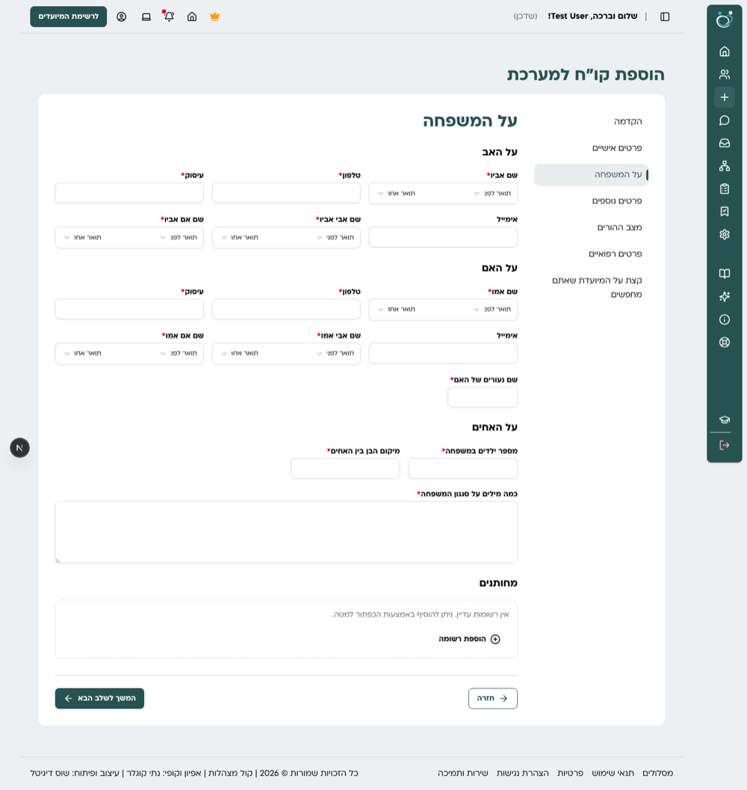
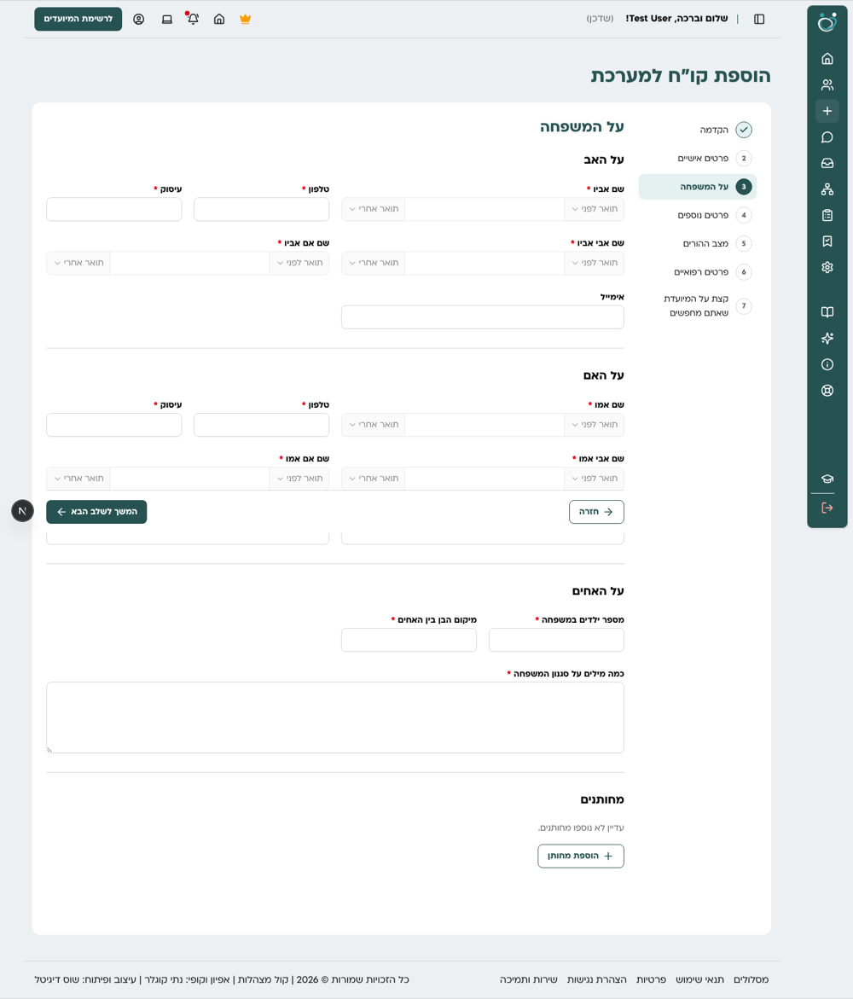

**טאבלט 1024, לפני ואחרי:**

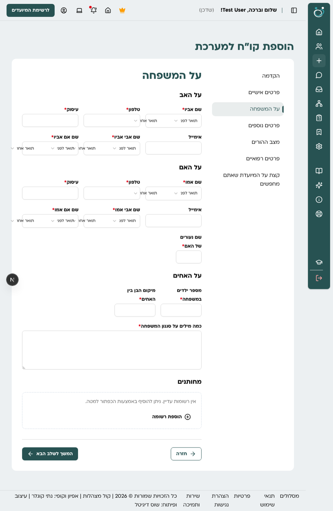
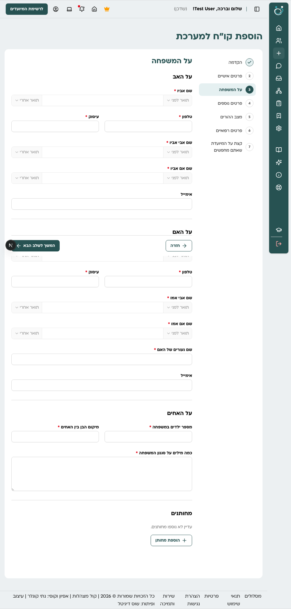

**מובייל 390, לפני ואחרי:**

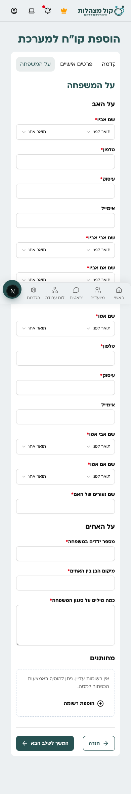
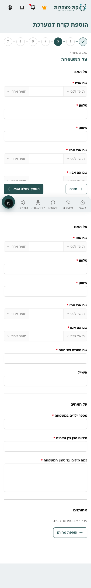

**שגיאות אחרי "המשך" עם שדות חסרים (1440 לפני ואחרי, ו-390 אחרי):**

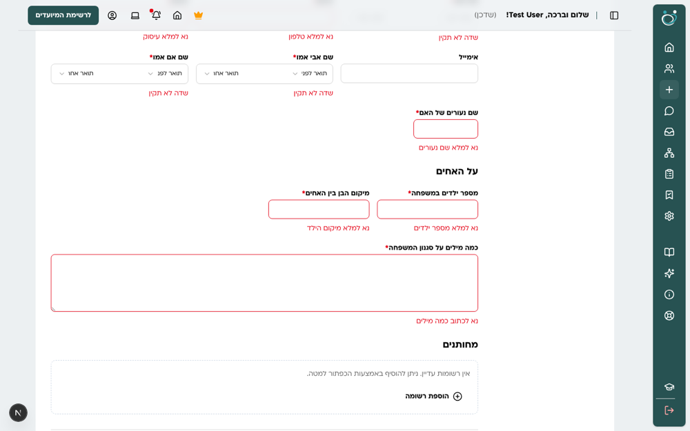
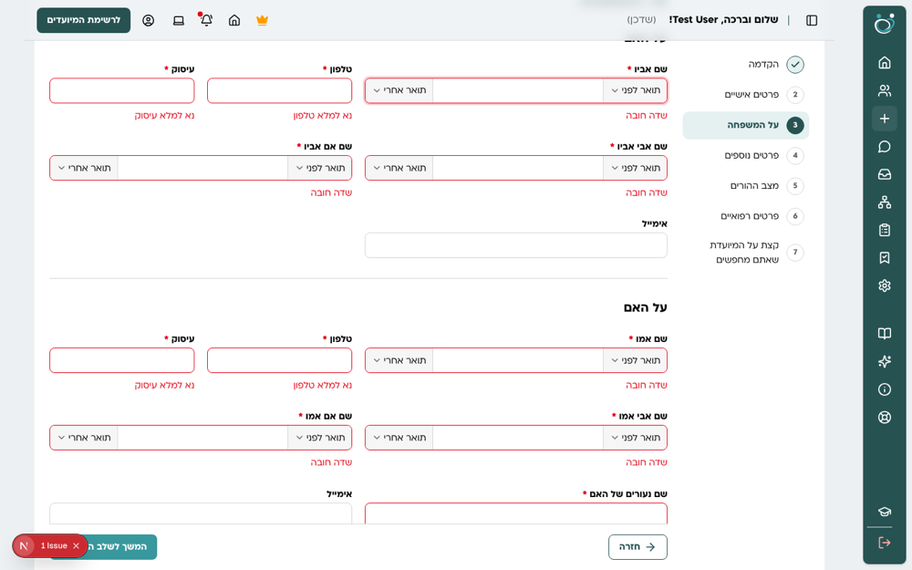
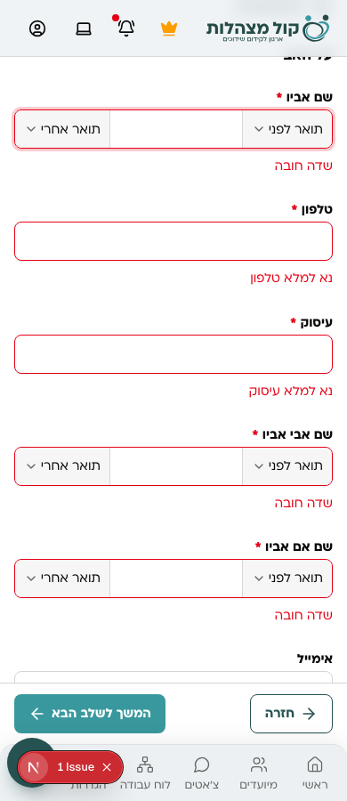

**מחותן שנוסף, מובייל:**

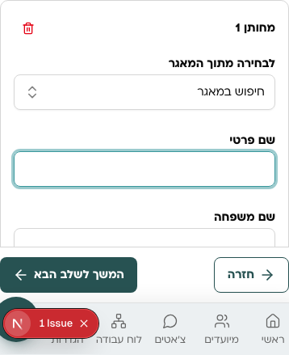

> בצילומי עמוד מלא סרגל הפעולות הדביק מופיע באמצע העמוד, כי הוא מוצמד לגובה
> המסך. בדפדפן הוא בתחתית המסך.

### המשך שלב 1

**בוצע בענף `claude/design-refactor-phase-1`:**

- רוחב סמנטי (`width`) בכל השלבים ובכל הרשומות החוזרות, עם תווית הוספה, כותרת ומצב ריק לכל רשומה.
- הודעות שגיאה ספציפיות לכל שדה ("נא למלא שם פרטי", "נא לבחור סטטוס אישי"), ממקום אחד (`field-messages.ts`).
- מנגנון חובה אחד: `required: true` במערך השדות קובע גם כוכבית וגם אכיפה, לפי תנאי התצוגה וגם בשורות של רשומה חוזרת.
- בורר התאריך העברי בגובה האחיד ועם מסגרת אדומה בשגיאה.
- "שם הכולל" במקום "שם הישיבה" ברשומת הכולל.
- "לבחירה מתוך המאגר" בישיבה קטנה, ישיבה גדולה, כולל וסמינר מחפש בטבלת `institutions` לפי סוג ומגדר, במקום `/educational-institutions/*` שהחזיר 404; הבחירה ממלאת שם ועיר.
- שדה חיפוש במצב שגיאה מקבל מסגרת אדומה; בעריכה אזור הקו״ח מציג את הקובץ השמור, קישור לפתיחה ואפשרות החלפה.
- פיצול: `dynamic-field.tsx` (1242 שורות) לרכיב לכל סוג שדה סביב `FormFieldShell`, ו-`fileds-data.ts` (2007 שורות) לתיקייה `fields-data/` עם קובץ לכל שלב ורשימות תוארים ואפשרויות משותפות. אין קובץ חדש מעל 211 שורות.
- `form.watch()` הוחלף ב-`useWatch` ממוקד: 5 הקשות בשם פרטי מרנדרות 5 שדות במקום 113 (29 כשהשדה עוד לא סומן כ"נגעו בו").

**פתוח:**

- חיפוש מחותן מתוך המאגר: `/users/mechutanim` לא קיים ומחזיר 404. ממתין להחלטה מאיפה מחפשים.
- בחירת מוסד מהמאגר נועלת את "קהילה / חסידות" בשורה (התנהגות קיימת), ולמאגר אין עמודת קהילה.
- `search-select-field.tsx` (381 שורות) לא פוצל.
